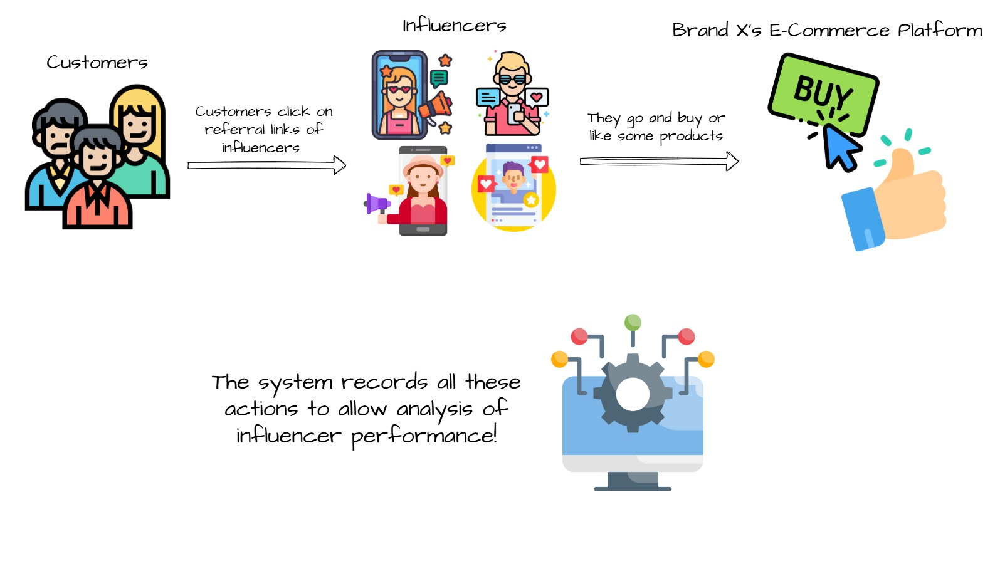
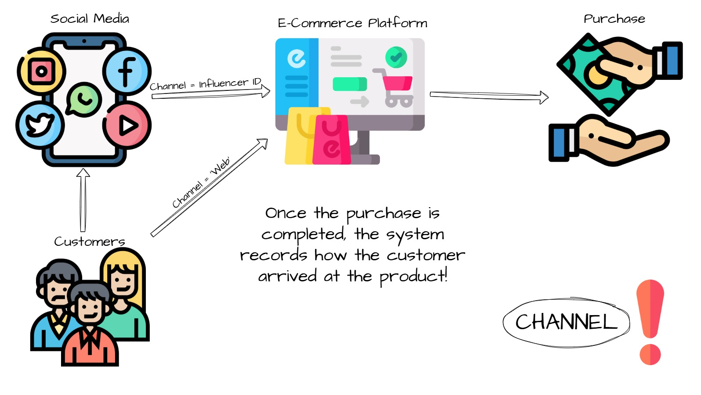
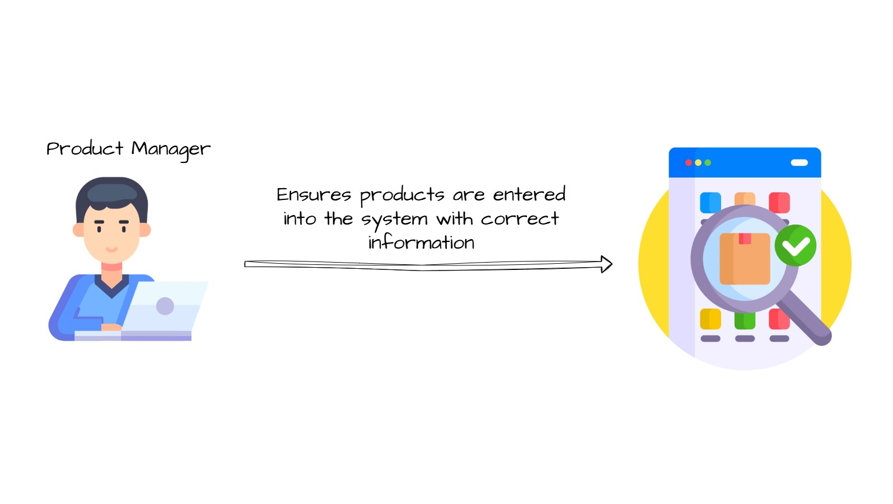
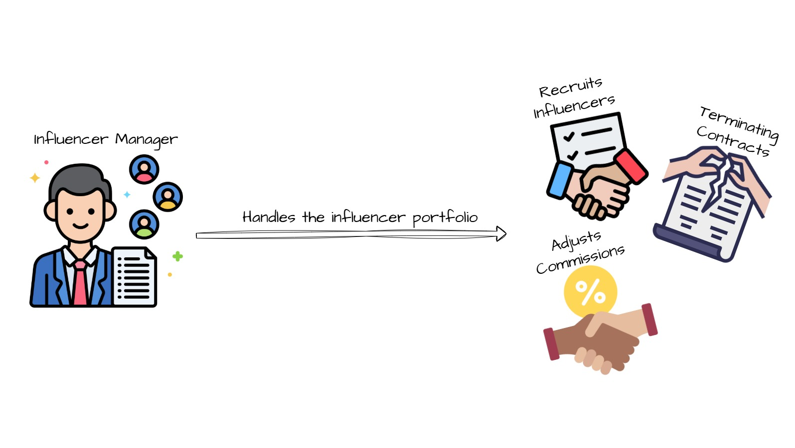
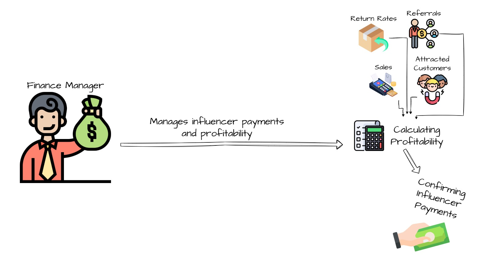
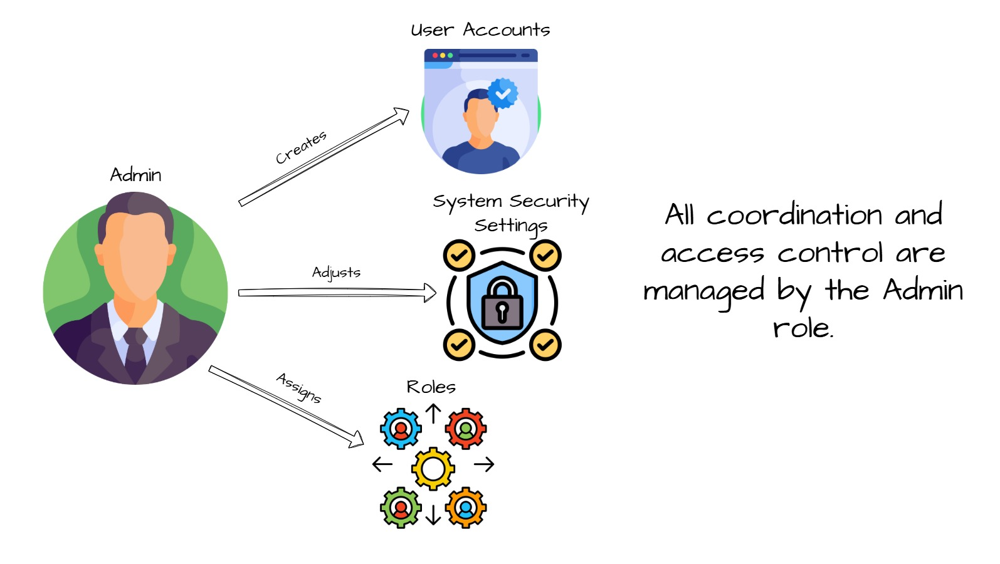
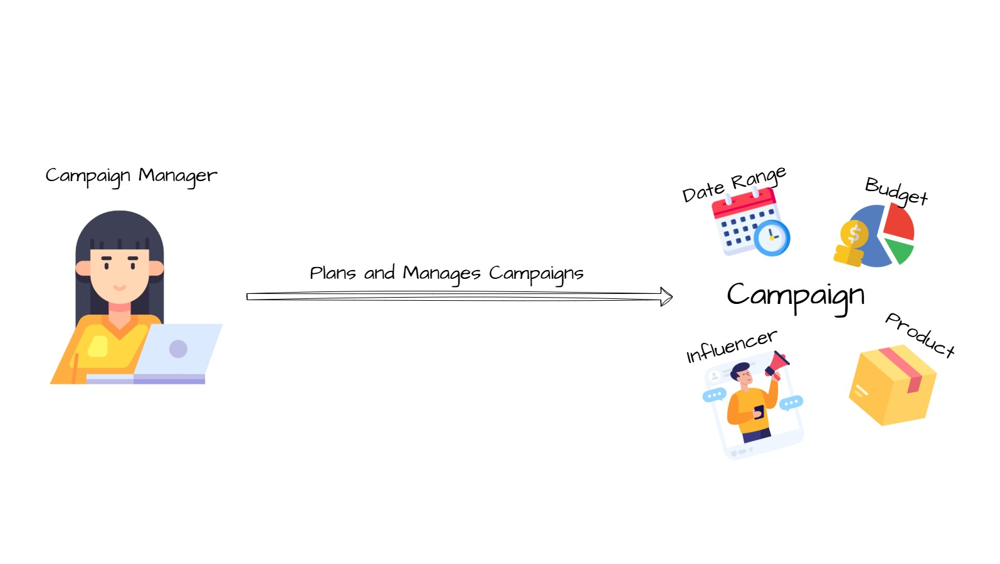
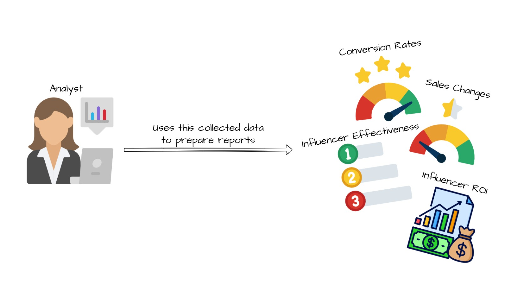
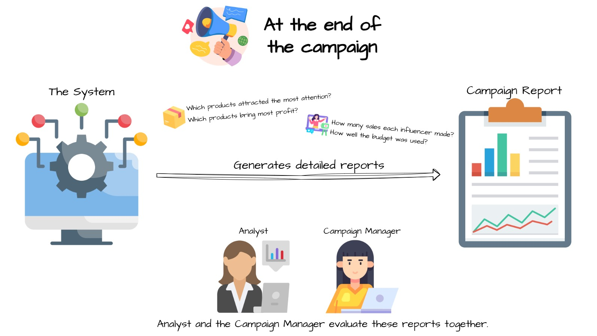
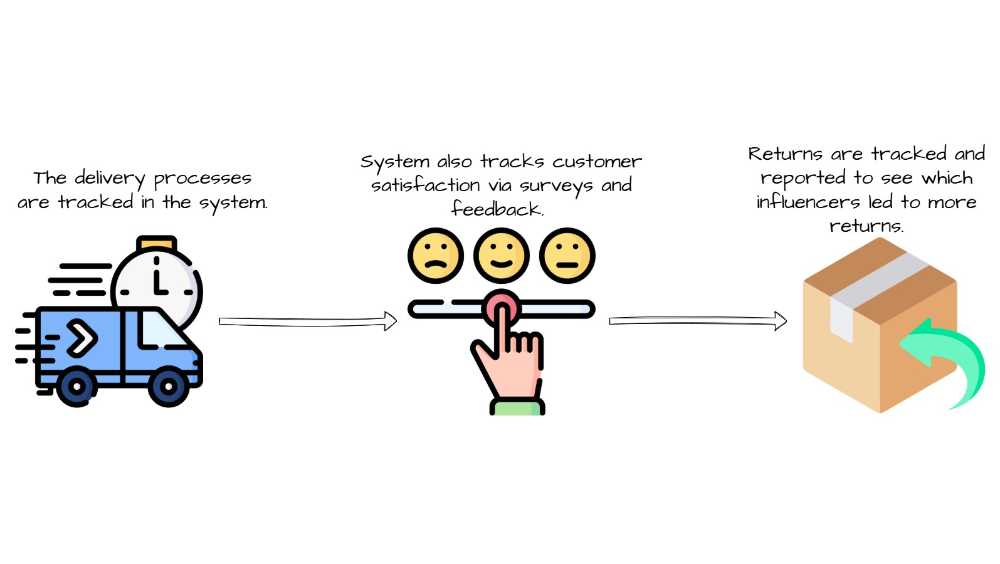

# Influencer Marketing ROI Analyzer  
*A PostgreSQL-powered software solution for tracking influencer marketing performance developed by 4 Turkish Computer Engineering Students under the supervision of a sector-professional.*

---

## 📌 Table of Contents
1. [Overview](#-overview)
2. [Visual Case Study](#visual-case-study)
3. [Features](#-features)
4. [Database Schema](#-database-schema)
5. [Demo](#-demo)
6. [Setup Guide](#-setup-guide)
7. [Folder Structure](#-folder-structure)
8. [Team & Acknowledgments](#-team--acknowledgments)
9. [Documentation](#-documentation)

## 🌟 Overview  
### The Problem with Primitive Influencer Marketing  
Most e-commerce platforms struggle to answer basic questions:  
- Which influencers actually drive profitable sales?  
- Who deserves higher commissions?  
- Which campaigns should get more budget?  

**Example Edge Case:**  
An influencer with 50K followers generates 100 sales, but 50% get returned. The system flags this as negative ROI due to:  
- Lost shipping costs  
- Inventory disruption  
- Damaged brand reputation  

Our solution tracks:  
✅ Sales & conversion rates  
✅ Customer acquisition costs  
✅ Return/refund rates  
✅ Campaign budget efficiency  

---

## Visual Case Study  
Here's how Brand X (a fictional e-commerce platform) uses our system:  

  
*Brand X is an e-commerce business with its own operational platform*  

  
*The brand aims to boost sales through influencer collaborations*  

  
*Every click, purchase, and like is recorded for analysis*  

  
*Actions are tagged with 'web' (organic) or 'influencer_id' for performance tracking*  

  
*Product Managers maintain accurate product data (price, stock, descriptions)*  

  
*Influencer Managers recruit partners and adjust commissions based on performance*  

  
*Finance Managers process payments and calculate campaign profitability*  

  
*Admins control system settings and user permissions*  

  
*Campaign Managers plan budgets and assign influencers/products*  

  
*Analysts generate performance reports from tracked data*  

  
*Analysts and Campaign Managers review reports together*  

  
*The system monitors delivery success and customer feedback*  
